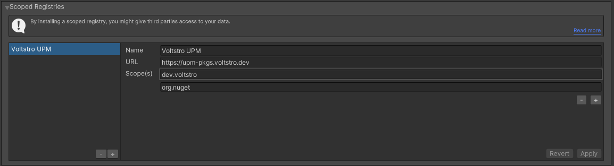
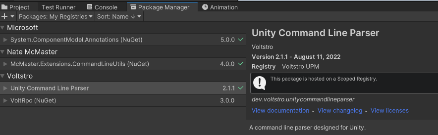

# Voltstro UPM Registry

[](https://upm-pkgs.voltstro.dev)
[](https://discord.voltstro.dev) 
[](https://www.youtube.com/Voltstro)

## What is Voltstro UPM Registry

This service is a [Unity packages](https://docs.unity3d.com/Manual/Packages.html) custom registry to provide Voltstro(-Studios) Unity packages. This service also acts as a mirror of [UnityNuGet](https://github.com/xoofx/UnityNuGet).

Like most registries, this one also uses [Verdaccio](https://verdaccio.org/).

## Setup

### GUI

To use the Voltstro UPM custom registry:

1. Project Settings **->** Package Manager

2. Add a new scoped registry to your project, using the details below.

If you are already using UnityNuGet, and you [don't want to use this registry as a mirror](#using-unitynuget-packages), then exclude `org.nuget` from the scopes.

4. Click 'Apply', you can now use the packages in this registry via the package manager.


### Editing `manifest.json`

You can also add this custom registry via editing your project's `manifest.json`, like so:

```json
{
  "dependencies": {
    ...
  },
  "scopedRegistries": [
    {
      "name": "Voltstro UPM",
      "url": "https://upm-pkgs.voltstro.dev",
      "scopes": [
        "dev.voltstro",
        "org.nuget"
      ]
    }
  ]
}

```

### Using UnityNuGet packages

The web view does NOT show UnityNuGet packages, however, they are there. Simply just making requests for the `org.nuget.*` packages will work. Any packages in the [UnityNuGet registry](https://github.com/xoofx/UnityNuGet/blob/master/registry.json) will work. See that project's README for more details.

## TOS

I am not a lawyer, so I will try to keep this section simple. Expect this part to change over-time.

1. Up-time/Availability

    I cannot guarantee a 100% up-time/availability. The server could be down for any number of reasons.

2. Mirroring

    If you want to you, you CAN mirror this registry, for either your own usage, or to publicly share. If you are using this registry in professional/organizational matter, then I suggested that you do mirror this registry to your own private one.

## Support

We do not provide any professional/enterprise support, we only provide the community [GH Discussions](https://github.com/Voltstro/VoltstroUPM/discussions). Please check/ask there.
